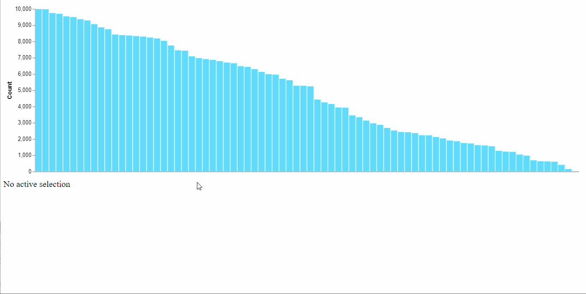

Demonstrates how to use [react-vega](https://github.com/vega/react-vega) with React Hooks to acheive a [brushing effect](https://infovis-wiki.net/wiki/Linking_and_Brushing).

- Uses a static spec referenced with useState
- Loads and sets the `data` state from an asyncronous source (use your imagination here; this could be a Redux reducer, another function, etc)
- Merges the previous `spec` state with the new data, which triggers a Vega component re-render

Bonus lap for my own use-case:

- Establishes an empty `selection` array
- Uses `signalListeners` to listen to selection set via brushing, then populate the `selection` array with a list of selected `id`s
- Reflects the selected `id`s in the UI (for use in indexing or `_.find`-ing elsewhere)

